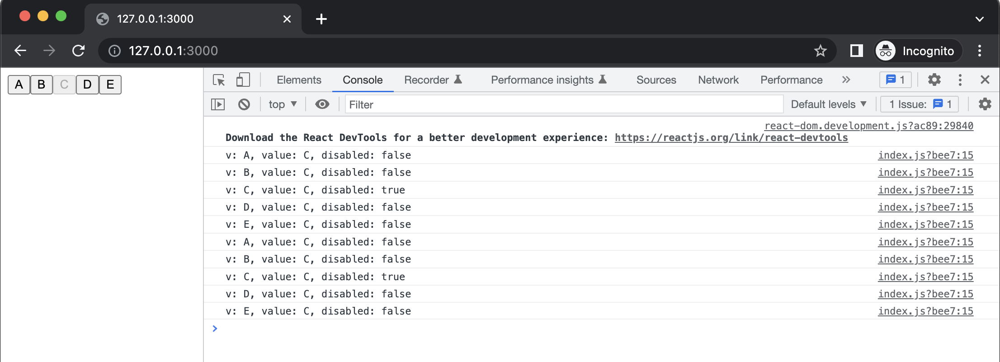
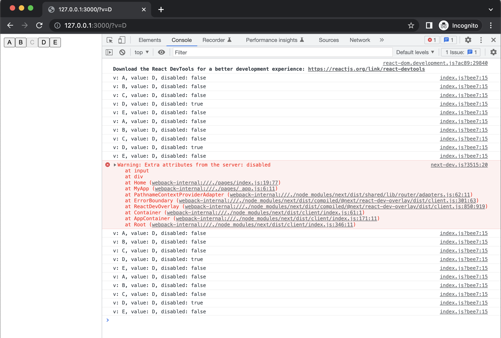
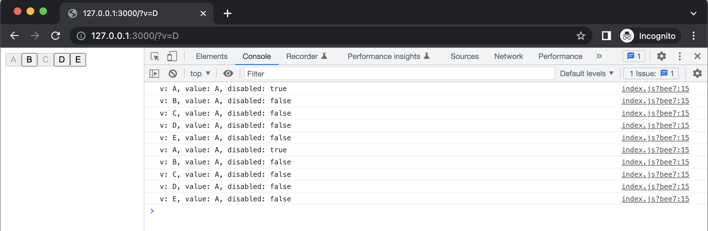
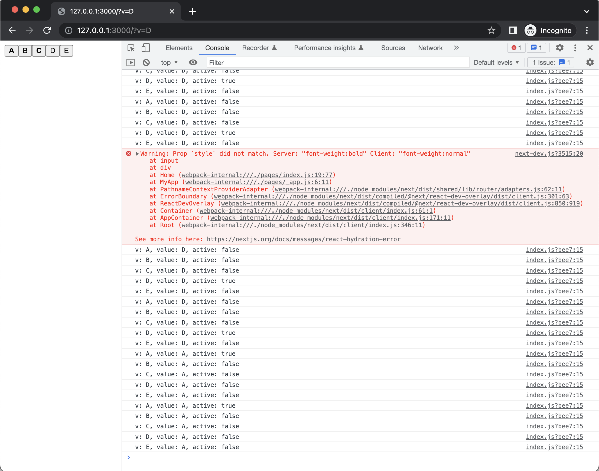

# nextjs-state-issue
Examining a bug(?) involving populating React state from URL query params

- [Repro](#repro)
  - [Boot `next dev` server ✅](#boot)
  - [View 127.0.0.1:3000 ✅](#view-default)
  - [Now try 127.0.0.1:3000?v=D ❌](#view-D)
  - [Click "A" ❌](#view-A)
- [Discussion](#discussion)
  - [Issue is not specific to the `disabled` attribute](#bold)

## Repro <a id="repro"></a>

### Boot `next dev` server ✅ <a id="boot"></a>
```bash
next dev
```

[`index.js`](./pages/index.js) just parses the URL query string for a "v" param, which is used to initialize one of 5 buttons ("C" by default):

```javascript
import {useRouter} from "next/router"
import {useState} from "react";

export const pathnameRegex = /[^?#]+/u

export default function Home() {
  const searchStr = useRouter().asPath.replace(pathnameRegex, '')
  const searchParams = new URLSearchParams(searchStr)
  const initialValue = searchParams.get('v') || "C"
  const [ value, setValue ] = useState(initialValue)
  return (
    <div>{
      ["A", "B", "C", "D", "E"].map(v => {
        const disabled = v === value
        console.log(`v: ${v}, value: ${value}, disabled: ${disabled}`)
        return <input key={v} type={"button"} value={v} disabled={disabled} onClick={() => setValue(v)} />
      })
    }</div>
  )
}
```

### View [127.0.0.1:3000](http://127.0.0.1:3000) ✅ <a id="view-default"></a>

```bash
open http://127.0.0.1:3000
```
Page renders without error, "C" is "active" (disabled) by default:



So far, so good.

### Now try [127.0.0.1:3000?v=D](http://127.0.0.1:3000?v=D) ❌ <a id="view-D"></a>



Several problems are visible:
- "C" is disabled (instead of "D")
- `console.log`s imply that "D" should be disabled, and "C" should not be
- Clicking "D" has no effect (something thinks it's already disabled)
- There's a console error about client and server "disabled" attributes not agreeing

### Click "A" ❌ <a id="view-A"></a>



- "A" and "C" are both disabled
  - There's no way to un-disable "C"; it is stuck due to having been default during server render
- `console.log`s imply only "A" should be disabled

## Discussion <a id="discussion"></a>

### Issue is not specific to the `disabled` attribute <a id="bold"></a>
At first I thought this might have to do with the `disabled` attribute being a boolean whose value is inferred from the presence or absence of the attribute (i.e. `<input type="button" [disabled] />` as opposed to `<input type="button" disabled="[yes|no]" />`).

However, the issue occurs if the "active" button is styled with e.g. `font-weight: [bold|normal]` instead of toggling `disabled` (see [`bold` branch](https://github.com/ryan-williams/nextjs-state-issue/blob/bold/pages/index.js#L14-L16)):

```diff
-        const disabled = v === value
-        console.log(`v: ${v}, value: ${value}, disabled: ${disabled}`)
-        return <input key={v} type={"button"} value={v} disabled={disabled} onClick={() => setVal>
+        const active = v === value
+        console.log(`v: ${v}, value: ${value}, active: ${active}`)
+        return <input key={v} type={"button"} value={v} style={{ fontWeight: active ? "bold" : "n>
```



- Page loads with "C" bolded, though "D" is supposed to be
- Clicking "A" results in "A" and "C" both bolded, though only "A" is supposed to be
- One difference from the `disabled` example is that you can click "C" here, and it resets the page to a consistent state:
  - "C" is understood to be the only "active" button (in the UI as well as `console.log`s)
  - Subsequent button clicks work as expected
