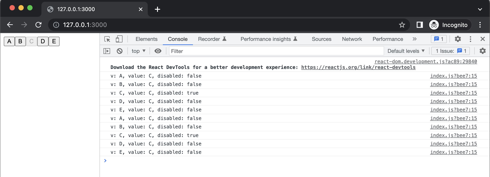
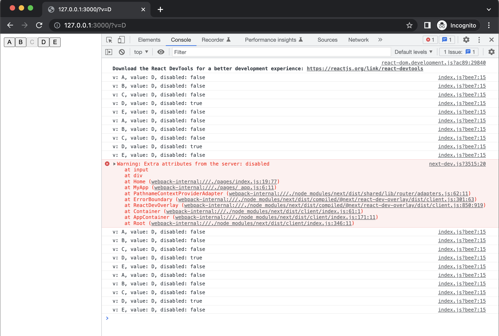

# nextjs-state-issue
Examining a bug(?) involving populating React state from URL query params

## Boot `next dev` server ✅
```bash
next dev
```

[`index.js`](./pages/index.js) just parses the URL query string for a "v" param, which is used to initialize one of 5 buttons ("C" by default):

```javascript
import {useRouter} from "next/router"
import {useState} from "react";

export const pathnameRegex = /[^?#]+/u

export default function Home() {
  const searchStr = useRouter().asPath.replace(pathnameRegex, '')
  const searchParams = new URLSearchParams(searchStr)
  const initialValue = searchParams.get('v') || "C"
  const [ value, setValue ] = useState(initialValue)
  return (
    <div>{
      ["A", "B", "C", "D", "E"].map(v => {
        const disabled = v === value
        console.log(`v: ${v}, value: ${value}, disabled: ${disabled}`)
        return <input key={v} type={"button"} value={v} disabled={disabled} onClick={() => setValue(v)} />
      })
    }</div>
  )
}
```

## View [`index.js`](./pages/index.js) ✅

```bash
open http://127.0.0.1:3000
```
Page renders without error, "C" is "active" (disabled) by default:



## Now try [127.0.0.1:3000?v=D](http://127.0.0.1:3000?v=D) ❌



A couple problems occur:
- "C" is disabled (instead of "D")
- `console.log`s imply that "D" should be disabled, and "C" should not be
- Clicking "D" has no effect (something thinks it's already disabled)
- There's a console error about client and server "disabled" attributes not agreeing

## Click "A" ❌


- "A" and "C" are both disabled
  - There's no way to un-disable "C"; it is stuck due to having been default during server render
- `console.log`s imply only "A" should be disabled
